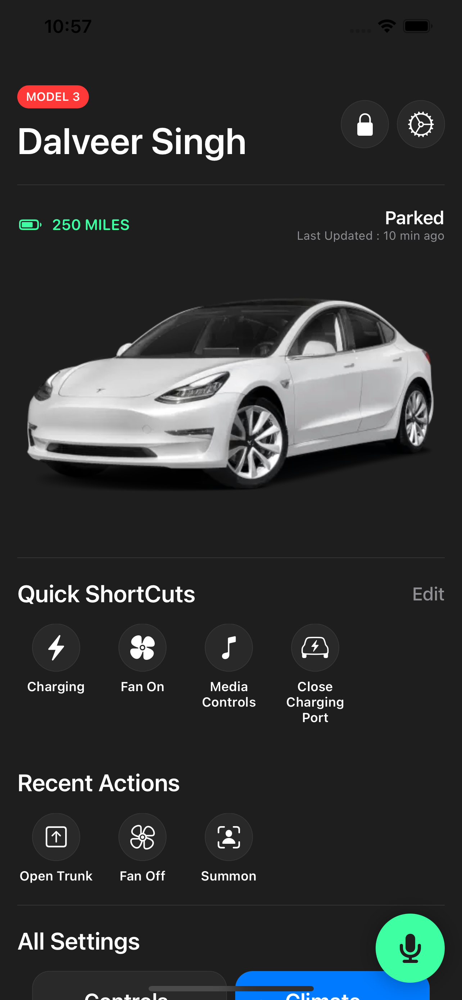
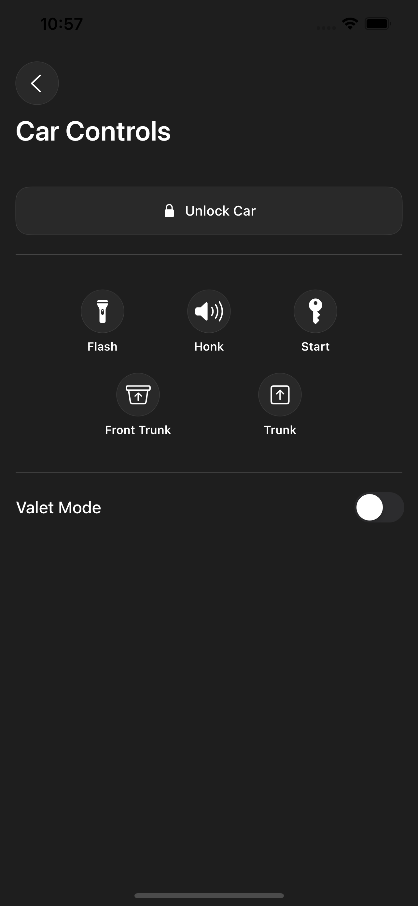
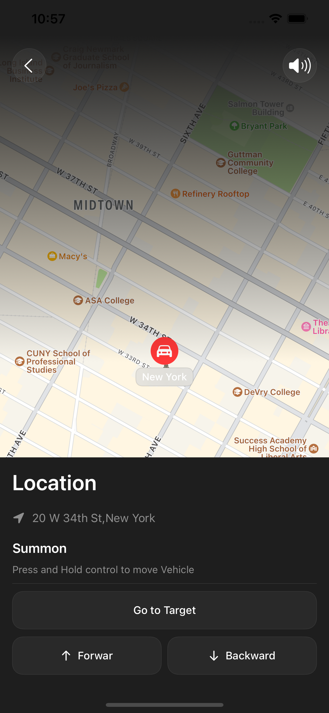
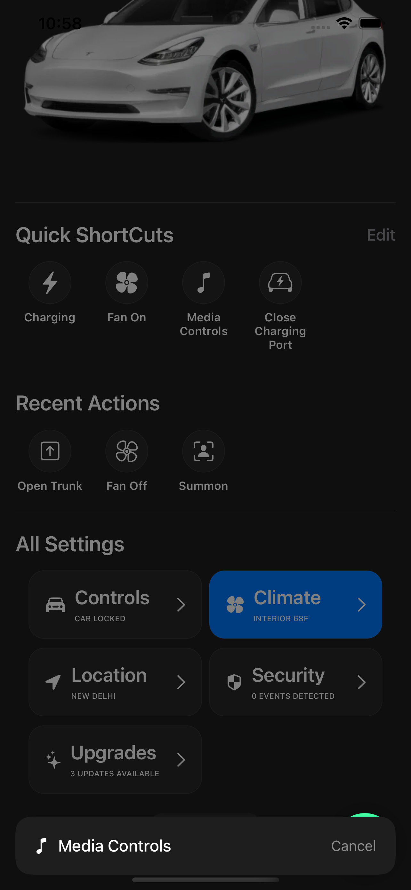
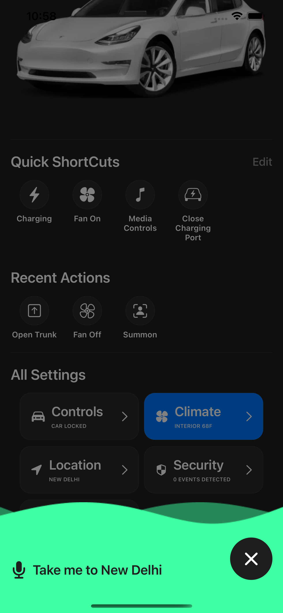
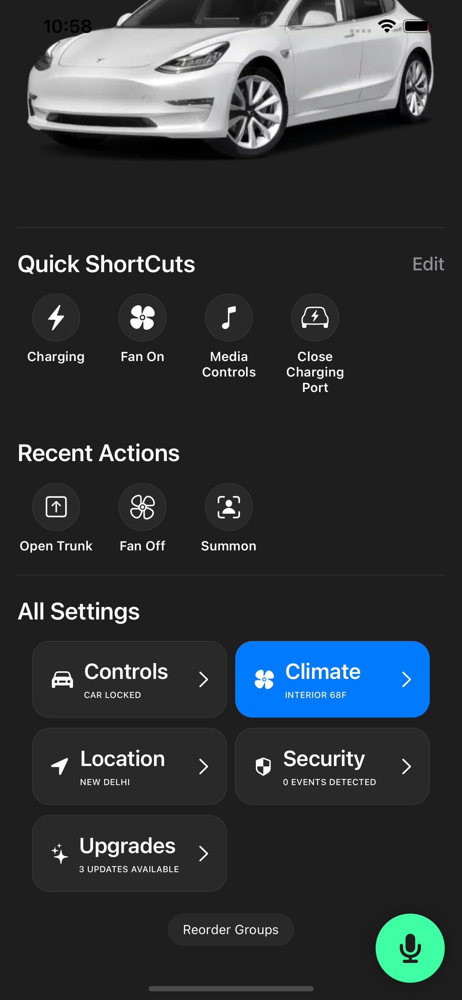

# Tesla-App-UI-Clone
## Getting Started ##

1. git clone [https://github.com/singhbaidwan/Tesla-App-UI-Clone](https://github.com/singhbaidwan/Tesla-App-UI-Clone)  
2. cd /Tesla-App-UI-Clone 
## Screenshots ##

<table>
<tr>
<td></td>
<td> </td>
<td></td>
</tr>
 
<tr>
<td></td>
<td> </td>
<td></td>
</tr>
   
</table>
